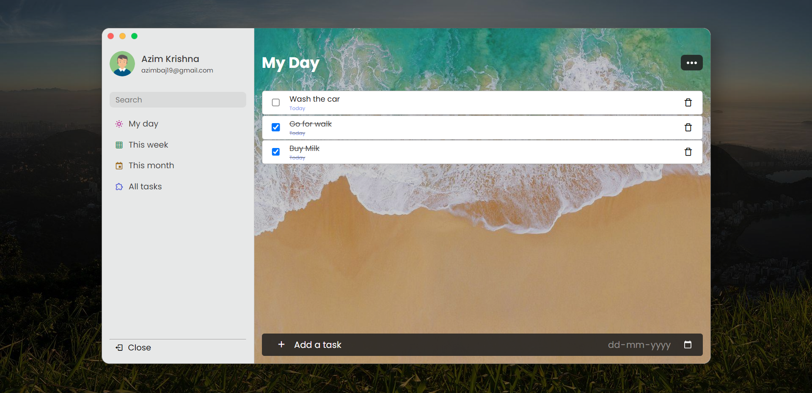
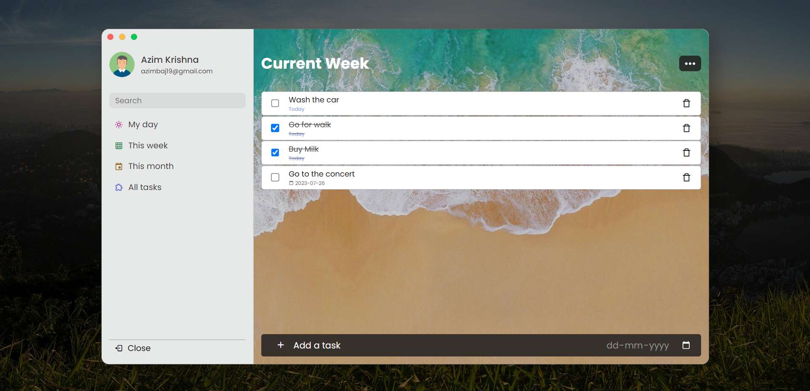
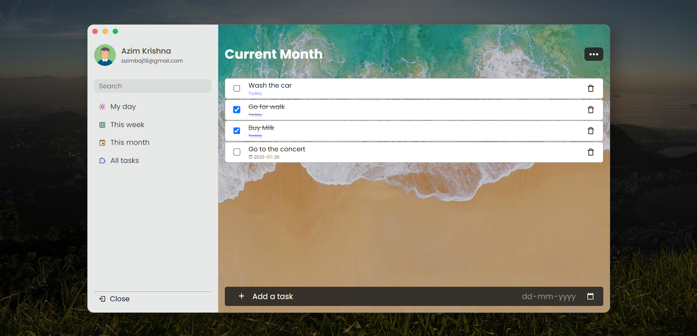
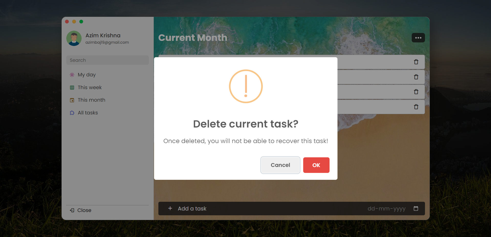
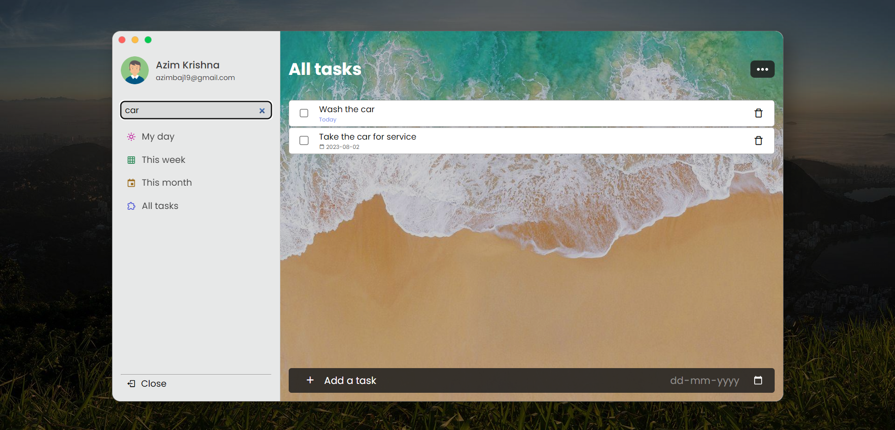
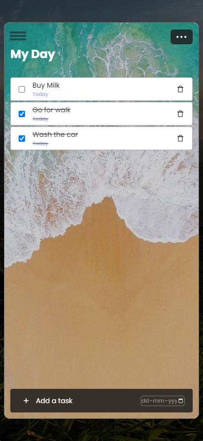

# Modern To-Do List App ✨


A beautiful, feature-rich task management application with dark mode, task priorities, categories, and more. Stay organized and productive with this modern to-do list!

## 🌟 Features

### Core Functionality
- ✅ **Task Management**: Add, edit, delete, and mark tasks as complete
- 🎯 **Task Priorities**: Organize tasks by High, Medium, or Low priority
- 🏷️ **Categories**: Tag tasks with custom categories for better organization
- 📅 **Smart Sections**: View tasks by "My Day", "This Week", "This Month", or "All Tasks"
- 🔍 **Real-time Search**: Instantly filter tasks as you type
- 📊 **Task Statistics**: Track completion progress at a glance

### Advanced Features
- 🌓 **Dark Mode**: Beautiful dark theme with glassmorphism effects
- 🎨 **Modern Design**: Vibrant gradients, smooth animations, and premium aesthetics  
- ✏️ **Inline Editing**: Click on task text or date to edit directly
- 📋 **Drag & Drop**: Reorder tasks by dragging them
- 💾 **Data Export/Import**: Backup and restore your tasks as JSON
- 📑 **Task Duplication**: Quickly copy tasks
- ⌨️ **Keyboard Shortcuts**: Press 'N' to create a new task
- 📱 **Fully Responsive**: Works perfectly on desktop, tablet, and mobile

### User Experience
- 👤 **Custom Profile**: Personalize with your name and email
- 💾 **Auto-save**: All data persists in browser localStorage
- 🎭 **Smooth Animations**: Delightful micro-interactions throughout
- ♿ **Accessible**: ARIA labels and keyboard navigation support

## 📸 Screenshots


*Modern interface showing tasks for "My Day" with dark mode enabled.*


*Task view for "Current Week" showing priority badges and categories.*


*Monthly task overview with task statistics.*


*Confirmation dialogs with modern styling.*


*Search functionality in action.*


*Mobile responsive design.*

## 🚀 Getting Started

### Prerequisites
- A modern web browser (Chrome, Firefox, Safari, Edge)
- A local web server (required for proper functionality)

### Installation

1. **Clone or Download** this repository
2. **Navigate** to the project directory:
   ```bash
   cd To-Do-List
   ```

3. **Start a local server**:
   
   Using Python 3:
   ```bash
   python3 -m http.server 8000
   ```
   
   Using Node.js (with `http-server`):
   ```bash
   npx http-server -p 8000
   ```
   
   Using PHP:
   ```bash
   php -S localhost:8000
   ```

4. **Open your browser** and go to:
   ```
   http://localhost:8000
   ```

> ⚠️ **Important**: Simply opening `index.html` directly in your browser won't work properly. You must use a local server for localStorage and other features to function correctly.

## 📖 How to Use

### Adding Tasks
1. Enter your task description in the input field
2. Select a due date
3. Choose a priority level (Low, Medium, High)
4. Optionally add a category
5. Press **Enter** or click the **+** button

### Managing Tasks
- **Complete**: Click the checkbox next to a task
- **Edit**: Click the edit icon or click on the task text
- **Change Date**: Click on the date to update it
- **Duplicate**: Click the copy icon
- **Delete**: Click the trash icon
- **Reorder**: Drag and drop tasks to reorder them

### Organizing Tasks
- **Sections**: Click on "My Day", "This Week", "This Month", or "All Tasks" in the sidebar
- **Search**: Type in the search box to filter tasks
- **Categories**: Tasks are automatically grouped by category

### Data Management
- **Export**: Click the download icon to save all tasks as JSON
- **Import**: Click the upload icon to restore tasks from a JSON file
- **Delete All**: Click the trash icon in the header (requires confirmation)

### Personalization
- **Dark Mode**: Click the moon/sun icon in the sidebar
- **Profile**: Your profile is set on first launch. Use logout to change it.

### Keyboard Shortcuts
- **N**: Focus on new task input
- **Enter**: Add a new task
- **Escape**: Cancel editing

## 🛠️ Technology Stack

- **HTML5**: Semantic markup with accessibility features
- **CSS3**: Modern styling with CSS custom properties, flexbox, and animations
- **JavaScript (ES6+)**: Modular architecture with classes
- **LocalStorage**: Client-side data persistence
- **SweetAlert**: Beautiful alert dialogs
- **Boxicons**: Crisp, modern icons
- **Google Fonts**: Inter font family

## 🎨 Design Philosophy

This app prioritizes:
- **Visual Excellence**: Premium design that wows users
- **User Experience**: Intuitive interactions and smooth animations
- **Accessibility**: ARIA labels and keyboard navigation
- **Performance**: Optimized rendering and efficient data handling
- **Responsiveness**: Perfect experience across all devices

## 🌐 Browser Compatibility

- ✅ Chrome 90+
- ✅ Firefox 88+
- ✅ Safari 14+
- ✅ Edge 90+

## 📝 License

This project is open source and available for personal and commercial use.

## 💡 Tips

- Use **priorities** to focus on what matters most
- Add **categories** like "Work", "Personal", "Shopping" for better organization
- Enable **dark mode** for comfortable late-night task planning
- **Export your data** regularly as a backup
- Use the **drag-and-drop** feature to organize tasks by importance

## 🙏 Acknowledgments

- Original concept inspired by modern task management tools
- Icons by [Boxicons](https://boxicons.com/)
- Fonts by [Google Fonts](https://fonts.google.com/)
- Alert library by [SweetAlert](https://sweetalert.js.org/)

## 📧 Contact

For questions, suggestions, or feedback:
- **Developer**: Your Name
- **Email**: your.email@example.com
- **GitHub**: your-github-username

---

**Happy organizing! 🎯✨**

Made with ❤️ and modern web technologies
